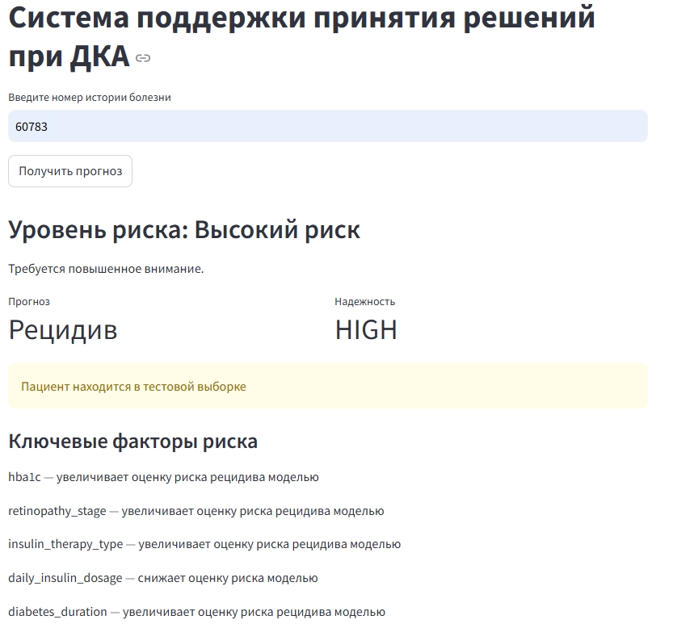
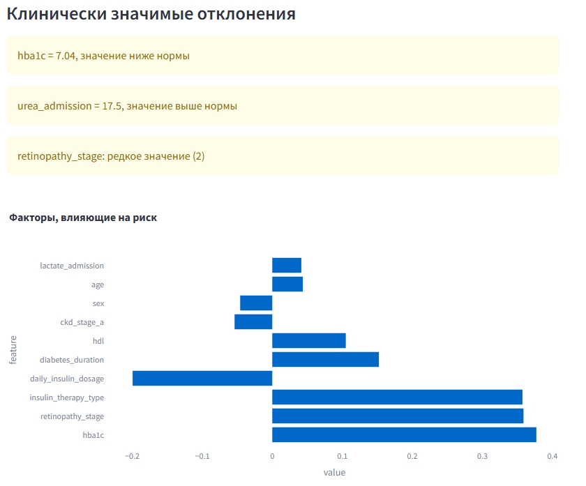
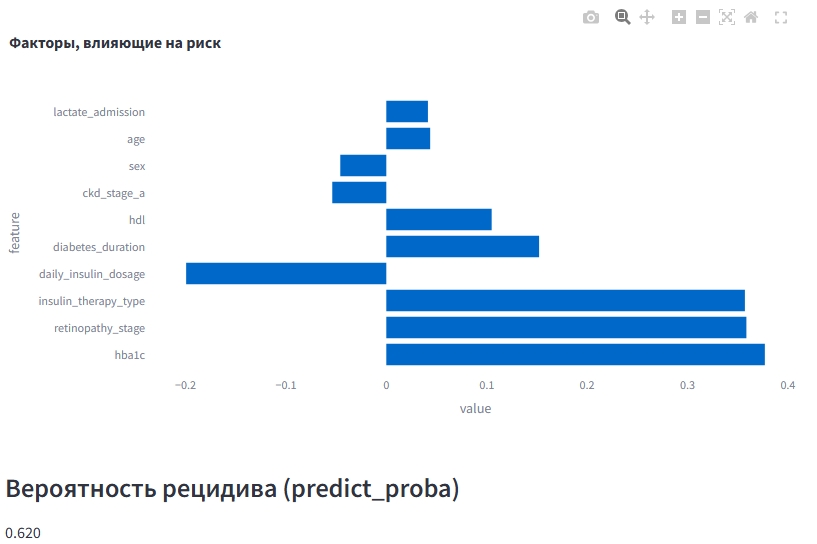

# Clinical Decision Support System for Diabetic Ketoacidosis Recurrence

## Overview

This project is an end-to-end clinical decision support system designed to predict the risk of diabetic ketoacidosis (DKA) recurrence.

The system combines:
- advanced EDA and feature engineering  
- ensemble model training optimized for medical constraints  
- prediction interpretability (SHAP + clinical rules)  
- API (FastAPI)  
- user interface (Streamlit)  

The project demonstrates advanced ML engineering practices such as nested cross-validation, ensemble learning, hyperparameter optimization, and model interpretability (SHAP).

For a deeper understanding of the system, refer to:
- [detailed feature engineering, data analysis, and preprocessing pipeline](src/eda/README_EDA.md)  
- [model inference logic, clinical interpretation layer, and service architecture](src/README_inference.md)  

The goal is not only to predict risk, but to provide **interpretable and clinically meaningful insights**.

---

## Data Access

Due to confidentiality requirements, the original medical data is not included in the repository.

Required files:
- df.parquet  
- train_ids.json  
- test_ids.json  
- original Excel file (optional)  

You may use your own dataset with a similar structure.

Trained models are not included.

To reproduce:
1. Run the training pipeline (`src/eda`)  
2. Models will be saved automatically  

Used:
- CatBoost (main model)  
- ensemble across outer folds  

---

## Key Features

- Recurrence probability prediction (`predict_proba`)  
- Risk level interpretation (low / medium / high)  
- Key factor identification (SHAP)  
- Automatic detection of:
  - clinical deviations  
  - rare categories  
- Prediction confidence estimation  
- Transparent train/test patient split  

---

## Machine Learning Pipeline

### Data Processing
- Data cleaning (missing values, quasi-constants, outliers)  
- Feature typing  
- Distribution and multimodality analysis  
- Automatic transformation selection  

---

### Feature Engineering
- Correlation analysis:
  - pairwise correlations  
  - triadic relationships  
- Redundant feature removal  
- Distribution transformations (log, yeo-johnson, robust scaling)  

---

### Model Training

Ensemble of models:
- CatBoost  
- LightGBM  
- XGBoost (tree + linear)  
- Random Forest  
- Logistic Regression  
- Decision Tree  

---

### Advanced Techniques

- Nested Cross-Validation (outer + inner CV)  
- Hyperparameter tuning (Optuna)  
- Class imbalance handling (`scale_pos_weight`, `class_weight`)  
- Threshold optimization under medical constraints:
  - recall control  
  - precision maximization  

---

### Ensemble & Stacking

- Averaging predictions across folds  
- Stacking (meta-model: Logistic Regression)  
- Ensemble combination search  

---

### Model Evaluation

- ROC-AUC (train / validation / test)  
- OOF (out-of-fold) evaluation  
- Classification metrics:
  - precision  
  - recall  
  - F1-score  
- Optimal decision threshold selection  

---

## Interpretability

- SHAP (TreeExplainer):
  - local patient-level explanations  
  - global feature importance  

- Clinical interpretation layer:
  - probability → risk level mapping  
  - key risk drivers  
  - anomaly detection (z-score)  
  - rare category detection  

---

## System Architecture

### Backend (FastAPI)
- REST endpoint: `/predict/{medical_record_id}`  
- Returns:
  - prediction  
  - probability  
  - confidence  
  - SHAP values  
  - clinical interpretation  

---

### Frontend (Streamlit)
- Patient ID input  
- Displays:
  - risk level  
  - key factors  
  - clinical deviations  
  - SHAP visualizations  
  - prediction probability  

---

## Tech Stack

- Python  
- Pandas / NumPy  
- Scikit-learn  
- CatBoost / LightGBM / XGBoost  
- Optuna  
- SHAP  
- FastAPI  
- Streamlit  
- Plotly  

---

## Key Value

The project demonstrates:
- building a production-ready ML system  
- working with medical data  
- balancing model performance and interpretability  
- integrating business logic (clinical layer) on top of ML  

---

## Example interface

## Author

Data Scientist: **OVELSAD**
